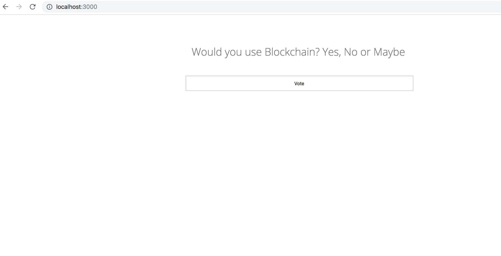
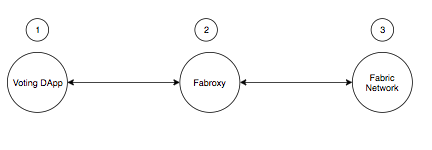
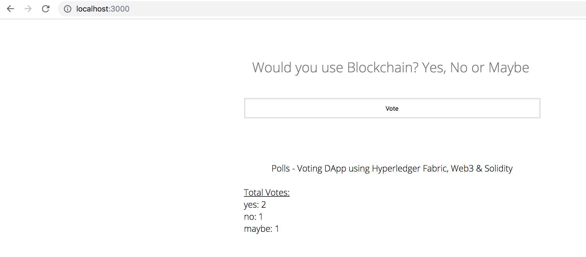

## Blockchain DApp - {Web3, Ethereum, Solidity, Hyperledger Fabric, Chaincode EVM}
Simple Web3 Hyperledger Fabric - Hyperledger [Burrow EVM](https://github.com/hyperledger/burrow) Voting Decentralized Application

With few clicks, run smart contracts from Solidity onto Ethereum Virtual Machine (EVM) that is embedded into Hyperledger Fabric to compiles these contracts as bytecode, of course, with the help of the chaincode.

<hr>


<hr>

Experience Ethereum into the world of permissioned platform of Hyperledger Fabric. This interaction is done through Hyperledger Chaincode EVM hosting Fabric Network to be compatible in compiling Ethereum smart contracts.

Let's consider the followings:
1. Hyperledger Chaincode EVM<br>
   1.1. Uses the Fabric Go SDK to plug and interact with the Fabric Network<br>
   1.2. Chaincode written in Go and made compatible for Ethereum smart contracts deployments and compilations<br>
   1.3. Build, start Fab3 proxy and make it available on port 5000<br>
2. Fabric Network<br>
   2.1. This is the replacement for Ethereum JSON RPC<br>
   2.2. Deals in different methods between: channel, peer and EVM <br>
3. Voting DApp<br>
   3.1. Node.js based, written in Javascript <br>
   3.2. Uses Web3 library to process smart contracts' deployments<br>
   3.3. Uses Solidity as a language to write the smart contracts<br>
   3.4. Placeholder of all interactions<br>

What you will learn:<br>
        .	Setup/install a decentralized app with: Fabric, Chaincode EVM and Ethereum<br>
	.	Writing, deploying and compiling Solidity smart contracts<br>
	.	Vote and display the polls on a simple web page

<hr>



<hr>

## Before we start
Make sure to have the following prerequisite tools are installed on your machine: [NPM](https://www.npmjs.com/), [Node](https://nodejs.org/en/), [Go](https://golang.org/dl/), [Docker](https://www.docker.com/)

These scripts in this project have been tried and are macOS compatible but if there are machine issues, then follow the steps [here](https://github.com/hyperledger/fabric-chaincode-evm/blob/master/examples/EVM_Smart_Contracts.md) to bring up the needed containers, peers and fab3 proxy up and running.

## STEPS



<hr>

__Read the full tutorial on how to build this application:__

<u>_Note:_</u> Take into consideration that running `./start/sh` will remove existing docker containers and images. If there are no containers or images on your machine, you can comment out the docker `stop`, `rm` and `rmi` in `start.sh`

* <b>STEP 1 - `./start.sh` - run this script file</b>

* <b>STEP 2 - copy/paste the following sections in the same terminal:</b>

```bash
1) # COPY/PASTE THIS SECTION IN THE TERMINAL

export CORE_PEER_MSPCONFIGPATH=/opt/gopath/src/github.com/hyperledger/fabric/peer/crypto/peerOrganizations/org1.example.com/users/Admin@org1.example.com/msp
export CORE_PEER_ADDRESS=peer0.org1.example.com:7051
export CORE_PEER_LOCALMSPID="Org1MSP"
export CORE_PEER_TLS_ROOTCERT_FILE=/opt/gopath/src/github.com/hyperledger/fabric/peer/crypto/peerOrganizations/org1.example.com/peers/peer0.org1.example.com/tls/ca.crt


2) # COPY/PASTE THIS SECTION IN THE TERMINAL

peer chaincode install -n evmcc -l golang -v 0 -p github.com/hyperledger/fabric-chaincode-evm/evmcc
peer chaincode instantiate -n evmcc -v 0 -C mychannel -c '{"Args":[]}' -o orderer.example.com:7050 --tls --cafile /opt/gopath/src/github.com/hyperledger/fabric/peer/crypto/ordererOrganizations/example.com/orderers/orderer.example.com/msp/tlscacerts/tlsca.example.com-cert.pem

```
* <b>STEP 3 - `./proxy.sh` - run this script file in a <u>_new_ terminal</u></b>. The fab3 proxy will be available at `localhost:5000`.


* In a different terminal, go back to the project's folder and run the web app locally by doing:

```javascript
1) npm install
2) npm start
```

Open your browser at [localhost:3000](http://localhost:3000) to view the app.

<hr>


<hr>


<hr>


<hr>



<hr>

## References

* [Hyperledger Fabric](https://github.com/hyperledger/fabric-samples)
* [Hyperledger Fabric Chaincode EVM](https://github.com/hyperledger/fabric-chaincode-evm)
* [Solidity](https://solidity.readthedocs.io/en/v0.4.25/index.html)
* [Web3](https://web3js.readthedocs.io/en/1.0/)
* [Ethereum JSON RPC API](https://github.com/ethereum/wiki/wiki/JSON-RPC)

## License
[Apache 2.0](LICENSE)
